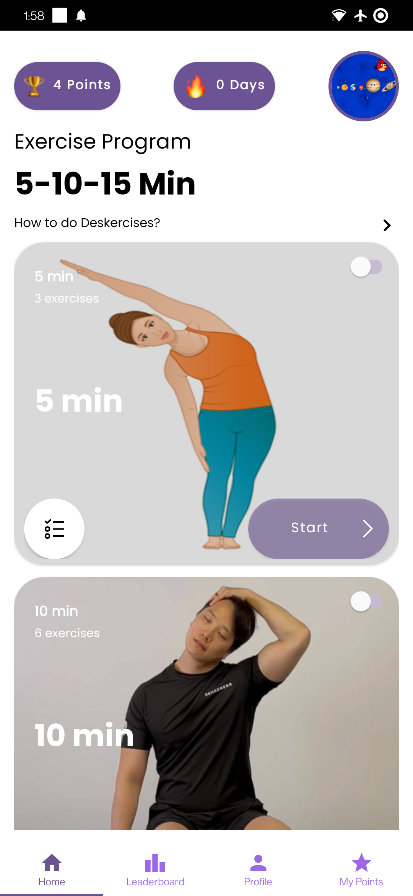
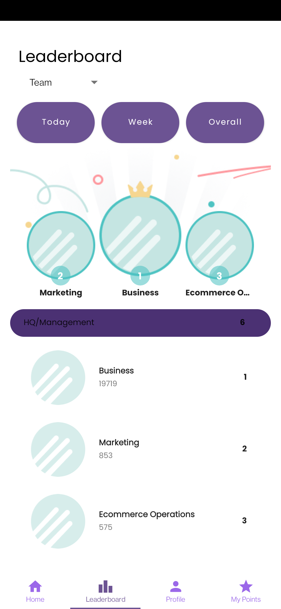
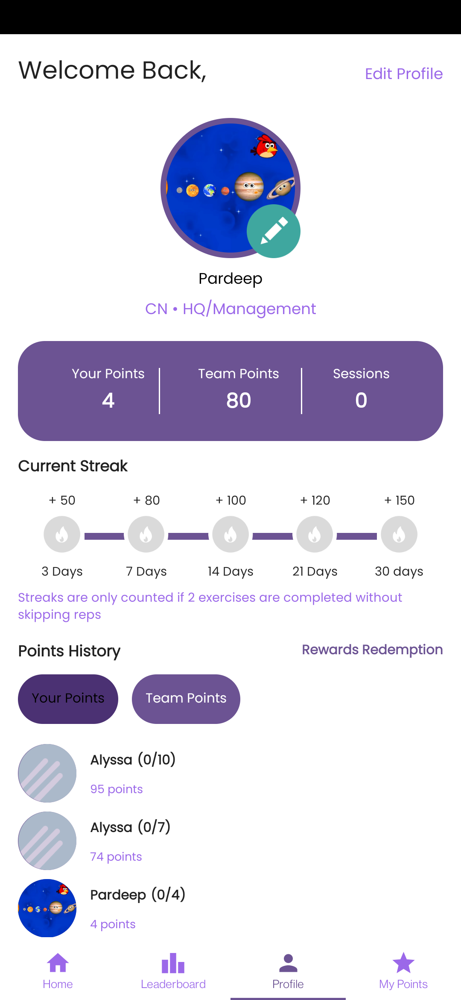

# deskercise-ai
Deskercise-AI is your personal trainer that provides step-by-step guidance for each exercise and progression, and your plan adapts over time as you complete.

It uses [Movenet](https://www.kaggle.com/models/google/movenet/) to detect body joint points and score users based on the exercising moves.

## Demo UI

## Screenshots

  
  
  

## Framework Components 🛠

Some of the popular libraries and MVVM clean architecture used with Room database as a source

* [Kotlin](https://kotlinlang.org/) - First class and official programming language for Android development.

* [Coroutines](https://kotlinlang.org/docs/reference/coroutines-overview.html) - Threads on steroids for Kotlin
* [Flow](https://kotlin.github.io/kotlinx.coroutines/kotlinx-coroutines-core/kotlinx.coroutines.flow/-flow/) - A cold asynchronous data stream that sequentially emits values and completes normally or with an exception.
* [StateFlow](https://kotlin.github.io/kotlinx.coroutines/kotlinx-coroutines-core/kotlinx.coroutines.flow/-state-flow/) - A live data replacement

* [Android JetPack](https://developer.android.com/jetpack) - Collection of libraries that help you design robust, testable, and maintainable apps.
   * [ViewModel](https://developer.android.com/topic/libraries/architecture/viewmodel) - Stores UI-related data that isn't destroyed on UI changes.
   * [ViewBinding](https://developer.android.com/topic/libraries/view-binding) - A robust replacement for findViewById, kotlin sytnhetics and DataBinding
   * [Navigation Components](https://developer.android.com/guide/navigation/navigation-getting-started) - Navigate fragments as never easier before
* [Material Components for Android](https://github.com/material-components/material-components-android) - Modular and customizable Material Design UI components for Android.

## Pending tasks:

* Unit test cases need to be written
* UI layer will be converted to Jetpack Compose

